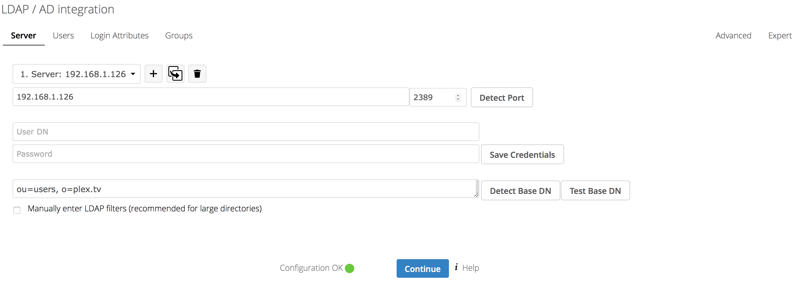
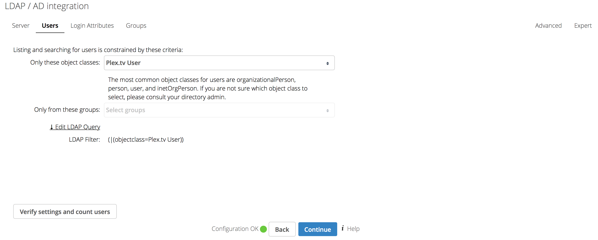
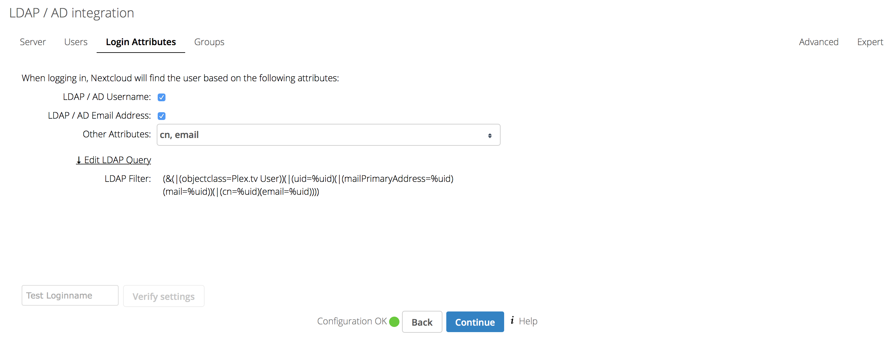
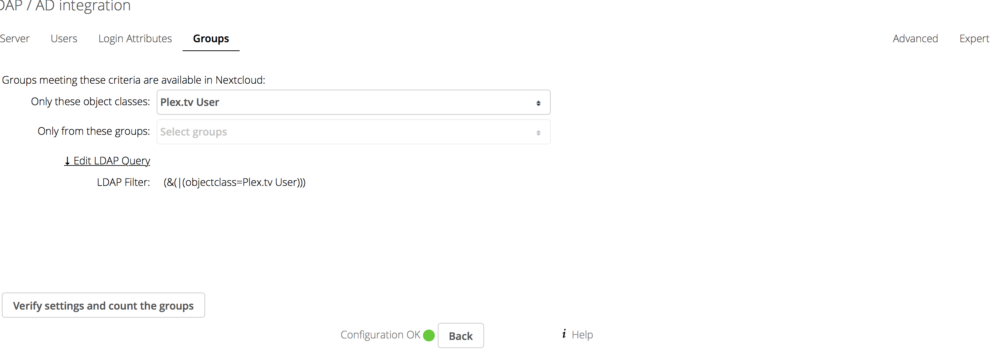
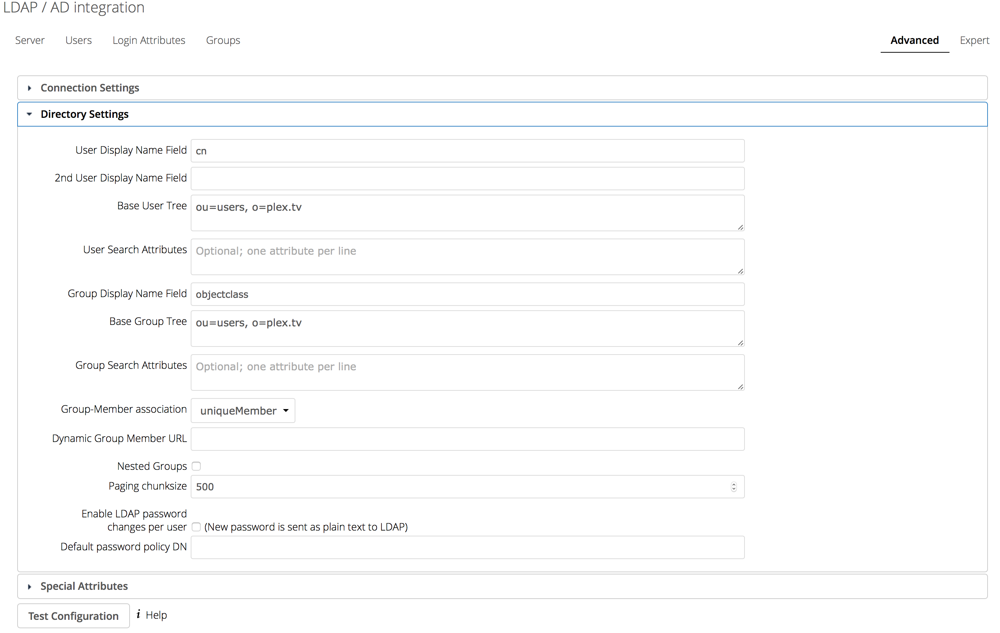
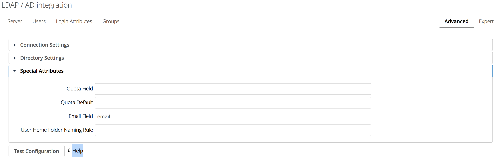
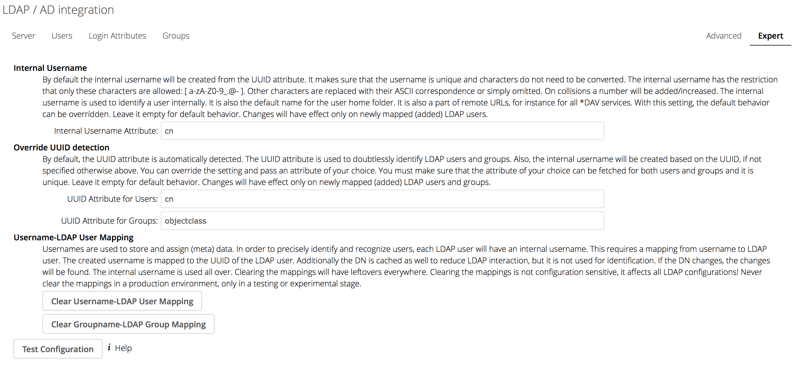

This tutorial will show you how you can use your and your friend's Plex login to login to Nextcloud.

## Setup LDAP-for-Plex

First you need to setup [this](https://github.com/hjone72/LDAP-for-Plex) piece of software, you can install it natively or use my docker for which you can find the tutorial [here](https://github.com/Starbix/dockerimages/tree/master/plex-ldap).

## Setup Nextcloud

* You need to enable `LDAP user and group backend` in Nextcloud which is an official app.

* Then go into the `LDAP user and group backend` settings and set like the following pictures:

 *Use the IP your LDAP for Plex instance runs on*

---

---

---

---

---

---

---

**Note:** It doesn't add the Plex users to the Plex.tv group automagically, you need to do that manually.